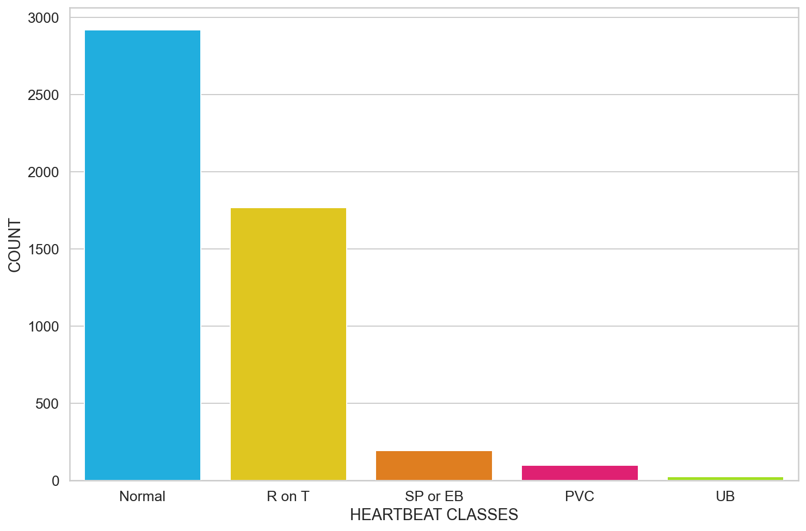
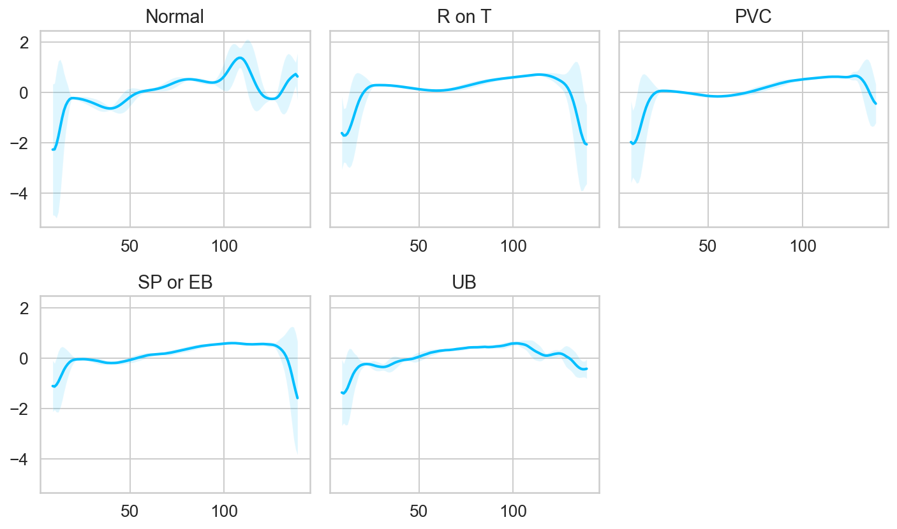
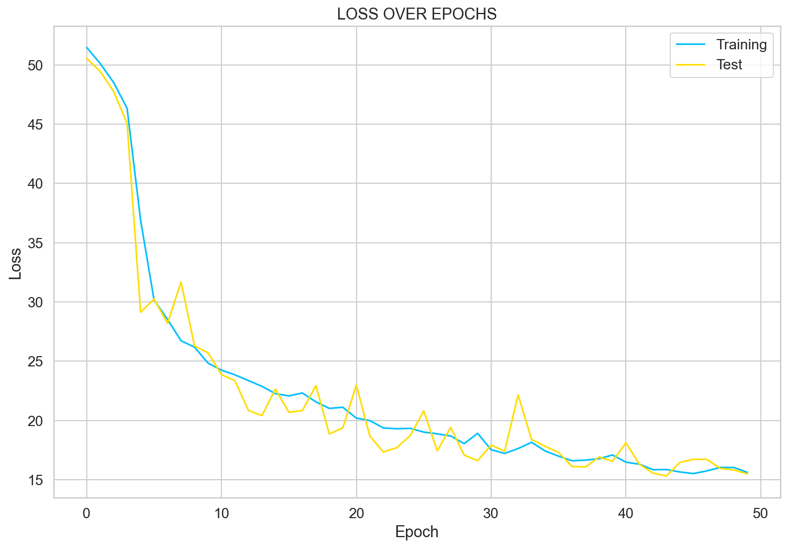
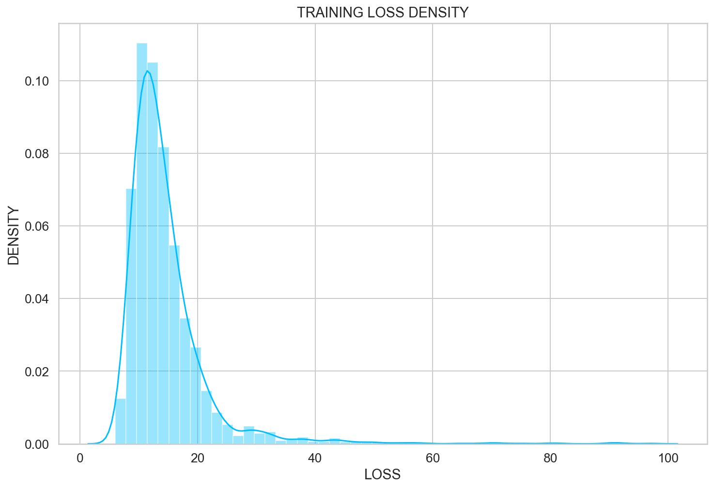
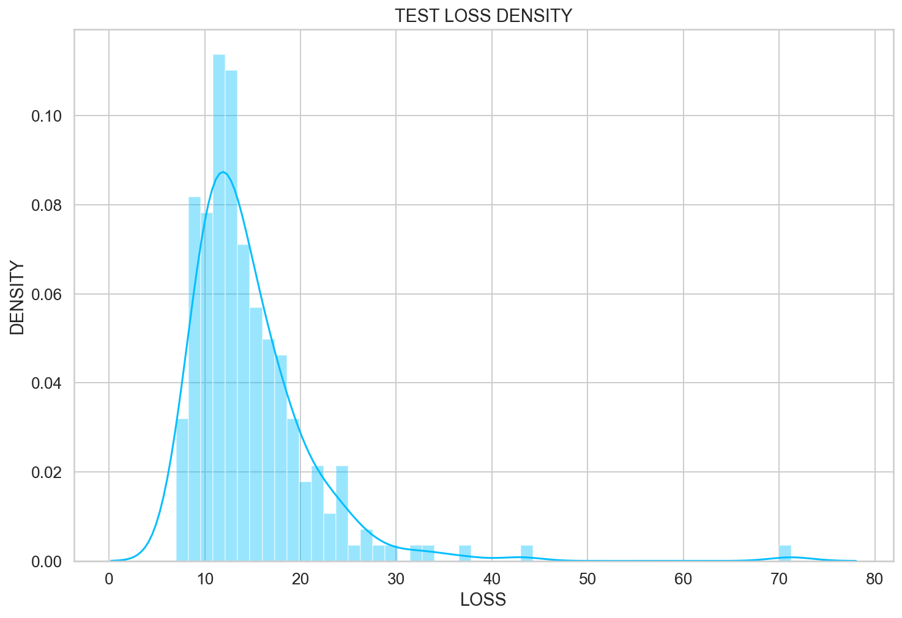
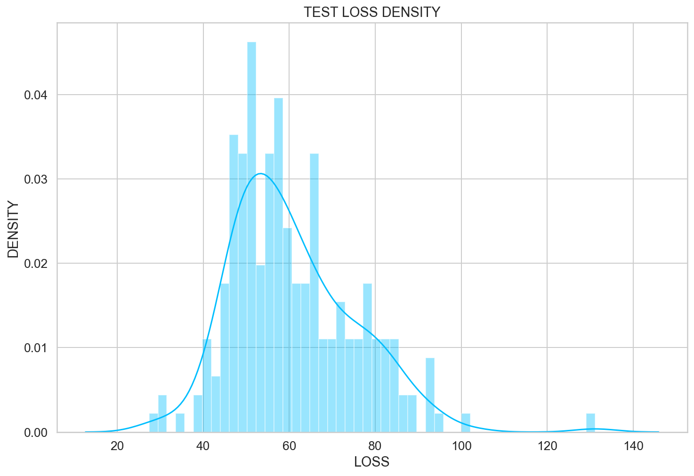
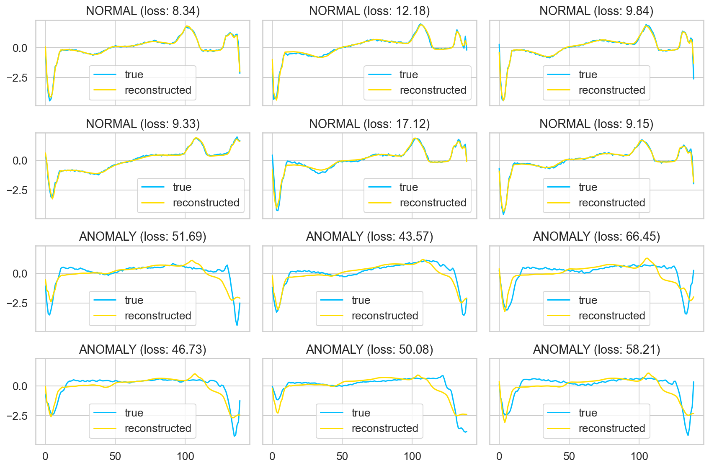

# ECG-Anomaly-Detection

Using an LSTM Autoencoder to detect abnormal heartbeats (anomalies) in real-world ECG data from a single patient with heart disease. 

### Expectation:
1. Prepare the dataset for Anomaly Detection from Time Series Data
2. Define the LSTM Autoencoder with PyTorch
3. Train and evaluate the LSTM model
4. Determine a threshold for anomaly detection 
5. Classify unsees ECG signals as normal / abnormal [Test the model]

## Data
Dataset: http://timeseriesclassification.com/description.php?Dataset=ECG5000

The dataset contains 5,000 Time Series examples (ECG's) with 140 timesteps. 
Each sequence corresponds to a single heartbeat from the same patient with congestive heart failure. 

> ECG - an electrocardiogram is a test that checks heart functionality by measuring electrical activity. An electrical impulse (wave) travels through your heart with each heartbeat causing the muscle to squeeze and pump blood to the body. 

The dataset contains 5 types (classes) of heartbeat:
1. Normal (N)
2. R-on-T Premature Ventricular Contraction (R-on-T PVC)
3. Premature Ventricular Contraction (PVC)
4. Supra-ventricular Premature / Ectopic Beat (SP or EB)
5. Unclassified Beat (UB)

> Healthy hearts typically beat at 65 - 75 bpm with a cardiac cycle (heartbeat) of around 0.8 seconds. 
> Frequency: 60 - 100 Hz
> Duration: 0.6 - 1 second 

[Source](https://en.wikipedia.org/wiki/Cardiac_cycle)

## Exploratory Data Analysis
The 5000 examples are split across the 5 classes as follows:

Normal ........ 2919 <br>
R on T .......... 1767 <br>
SP or EB ...... 194 <br>
PVC ............. 96 <br>
UB ............... 24 <br> 



The Autoencoder will be trained using the **Normal** ECG signals. 

If we consider the averaged Time Series for each class below we notice the 'Normal' class has a distinctly different pattern which should prove extremely useful when trying to detect anomalies. 



## LSTM AUTOENCODER
The autoencoder should take the input data (individual heartbeat), pass it through the model, and obtain a reconstructed version of the input as closely matched as possible. 

Using a low number of layers and parameters in the model will ensure a compressed representation of the data is used, providing a better chance of success. In other words, Autoencoders attempt to learn only the **most important features** (compressed) of the data. In this case, using a two layered LSTM we will capture the temporal dependenies of the data. 

### Reconstruction Loss & Anomaly Threshold
Since the objective is to reconstruct the input signal as best as possible, we will need to minimise the loss function - similar to supervised learning. 
This function is known as **reconstruction loss**. 

Model trained using 85% of the 'Normal' heartbeat data and tested with the remaining unseen 15%:
```
| EPOCH: 1   | TRAIN LOSS: 51.47  | VAL LOSS: 50.55  | EXEC. TIME: 7.54 min  |
.
.
.
| EPOCH: 49  | TRAIN LOSS: 16.03  | VAL LOSS: 15.82  | EXEC. TIME: 7.52 min  |
| EPOCH: 50  | TRAIN LOSS: 15.61  | VAL LOSS: 15.49  | EXEC. TIME: 7.57 min  |
```



Once each sequence in the training dataset is classified as Normal, we can determine a threshold above which the heartbeat will be considered abnormal. 

    THHRESHOLD = 26
    


### Evaluation
Since we have a threshold, the task resembles a simple binary classification task. 

i.e. if the reconstruction loss in future is below the threshold, the heartbeat can be considered **normal**. Alternatively, any loss higher than the threshold is classified as an **anomaly**. 

#### Normal Heartbeats
Using a completely seperate training dataset of 'Normal' heartbeats, we can determine how well our model works at determining normal heart beats:

    Correct normal predictions: 209/219



#### Anomalies
Repeating the process again however with a test dataset of anomalies:

    Correct anomaly predictions: 218/219



**Fantastic results!**
The Autoencoder was able to determine **~99.5%** of the abnormal heartbeats. 
We can tweak the threshold depending on the kind of errors to tolerate - In this case, having more false positives (normal heartbeats considered as anomalies) than false negatives (anomalies considered as normal) might be advantageous.

### Visualizing the reconstructions
By overlaying the real and reconstructed Time Series values we can see how similar they are. We will select just the first 6 tensors from the Normal and Anomaly tests:



## Summary
While the Time Series data is univariate (only 1 feature), the code should work for multivariate datasets (multiple features) with little or no modification.

## References
https://github.com/shobrook/sequitur
https://towardsdatascience.com/lstm-autoencoder-for-anomaly-detection-e1f4f2ee7ccf
